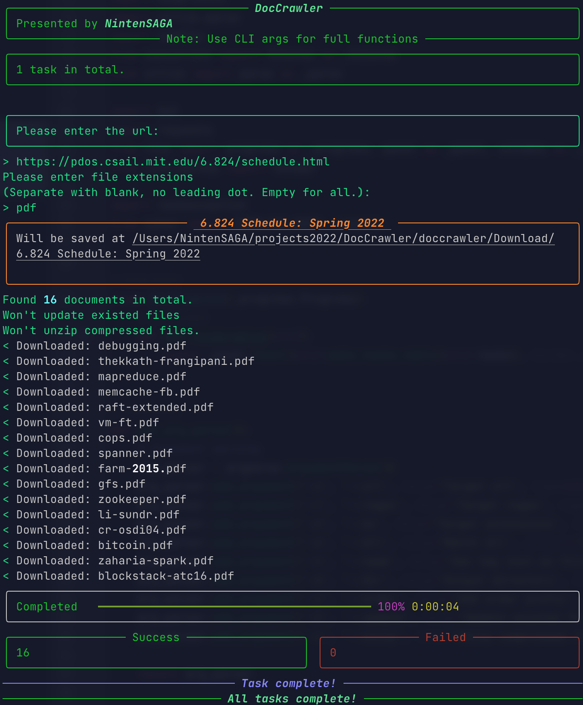
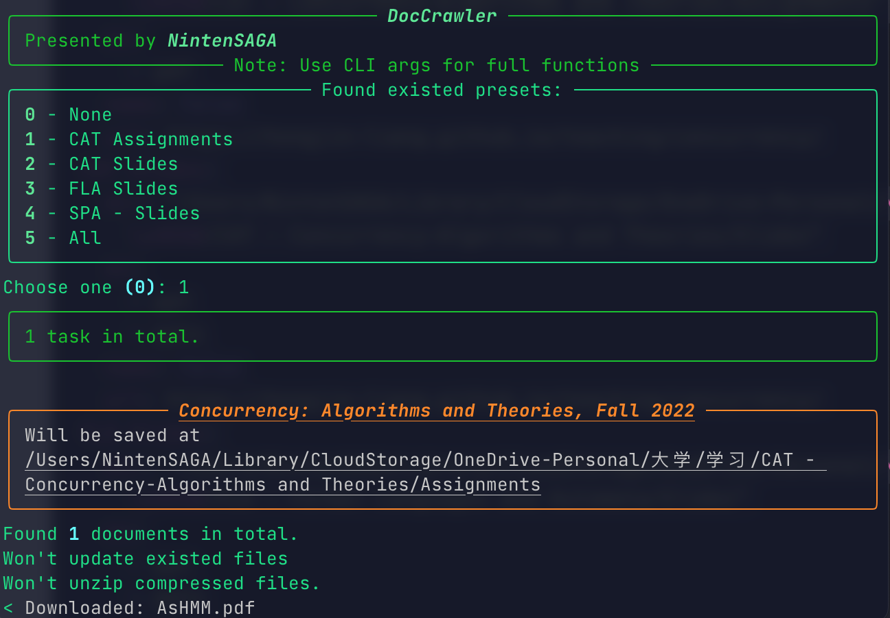
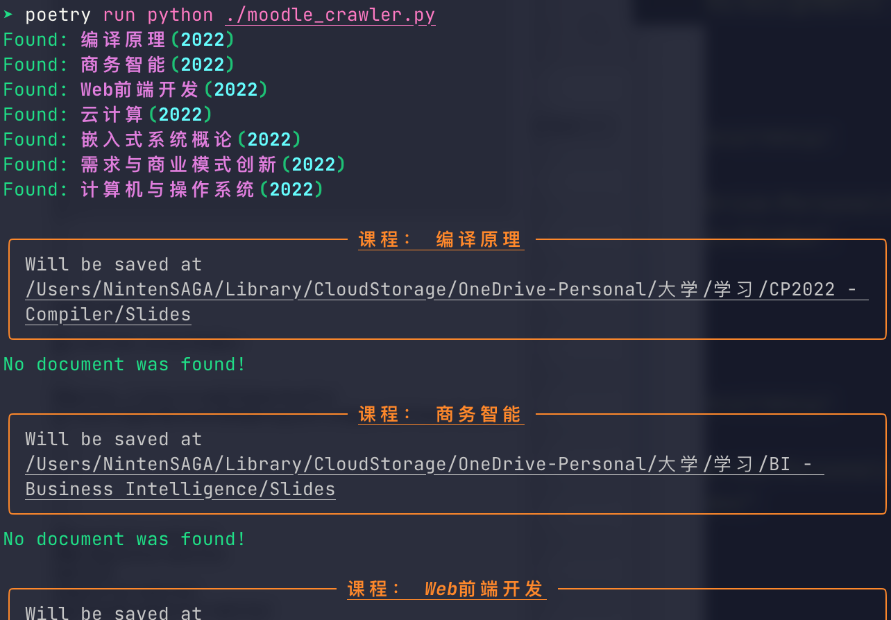

# DocCrawler

<!--
[TOC]
-->

## Updates

2022.09.21:

- Now Moodle Crawler can download **videos** and **folders**
- Now you can exclude particluar courses in Moodle Crawler

- Now Moodle Crawler supports **login by scanning WeChat QRCode**.
- Download path is changed to `.../DocCrawler/Download`
- Now the crawler will show whether a file was updated

## Setup

```
python = "^3.10"
rich = "^12.5.1"
PyYAML = "^6.0"
bs4 = "^0.0.1"
requests = "^2.28.1"
Pillow = "^9.2.0"
rarfile = "^4.0"
html5lib = "^1.1
```

Dependencies are managed by Poetry. Hence you can either install them manually or (requiring Poetry installed):

```shell
.../DocCrawler> poetry install
.../DocCrawler> poetry run python ./doccrawler/general_crawler.py # General
.../DocCrawler> poetry run python ./doccrawler/moodle_crawler.py # Moodle
```

## Usage

DocCrawler contains two tools.

### GeneralCrawler

Can be used to crawl docs on any websites, filtered by extensions or regex pattern.

Default output directory is `.../DocCrawler/Download`

You can use it with cli arguments:

```
usage: general_crawler.py [-h] [-u URL] [-r REGEX] [-e EX [EX ...]] 
													[-a] [-n] [-d DIR]
                          [-o] [-U] [-z]

options:
  -h, --help            show this help message and exit
  -u URL, --url URL     Target url
  -r REGEX, --regex REGEX
                        Target regex
  -e EX [EX ...], --ex EX [EX ...]
                        Target extensions
  -a, --all             Match all
  -n, --name            Use tag text as filename
  -d DIR, --dir DIR     Output directory
  -o, --order           Add order prefix
  -U, --update          Update existed file
  -z, --unzip           Unzip compressed files
```

Or execute it without any args to enter the interactive setup:



#### Configs

The config file is `.../DocCrawler/general_config.yaml`, using YAML syntax.

You can add presets to the configs in the following manner:

```yaml
websites:
  $Preset_name$:
    $arg0$: ...
    $arg1$: ...
    ...
```

Example:

```yaml
websites:
  CAT Assignments:
    dir: "~/Library/CloudStorage/OneDrive-Personal/CAT - Concurrency-Algorithms and Theories/Assignments"
    ex:
      - pdf
    name: false
    url: https://h*******g.github.io/teaching/concurrency/
  CAT Slides:
    dir: "~/Library/CloudStorage/OneDrive-Personal/CAT - Concurrency-Algorithms and Theories/Slides"
    ex:
      - ppt
      - pptx
    name: false
    url: https://h*******g.github.io/teaching/concurrency/
  FLA Slides:
    dir: "~/Library/CloudStorage/OneDrive-Personal/FLA - Formal Languages and Automata/Slides"
    ex:
      - ppt
      - pptx
    name: true
    order: true
    url: https://c*******n/bulei/FLA22.html
  SPA - Slides:
    dir: "~/Library/CloudStorage/OneDrive-Personal/SPA - Static Program Analysis/Slides"
    ex:
      - pdf
    name: false
    order: true
    url: http://t*******b.net/lectures.html
```



### MoodleCrawler

Can be used on the new Moodle website of NJU SE. This will automatically scan all the courses you have joined and download their resources.

A valid Cookies string should be provided when you run it for the first time, or when the previous cookies is invalid.



#### Configs

The config file is `.../DocCrawler/general_config.yaml`, using YAML syntax, which will be generated automatically.

You can edit the configs in the following manner:

```yaml
moodle:
  cookies: ...
  courses:
    $CourseID$: # Generated
      dir: ...
      my_args: [$arg1$, $arg2$, ...]
      name: ... # Generated
      exclude: ... # True or False
```

